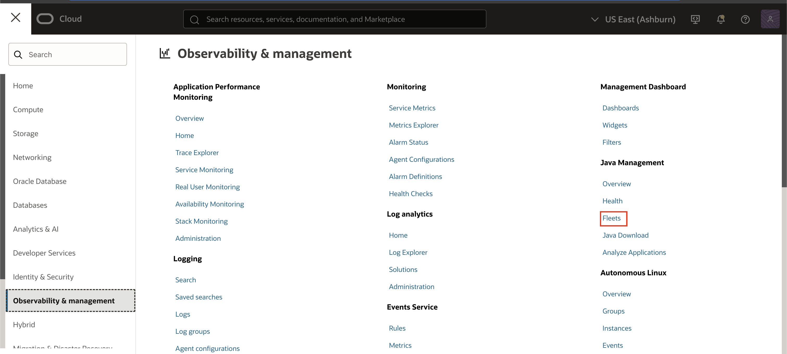
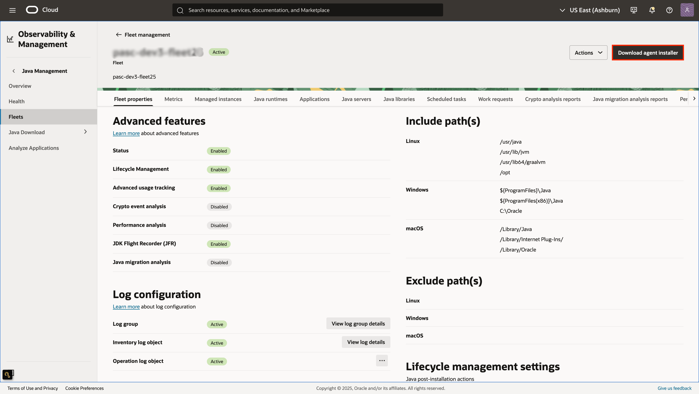
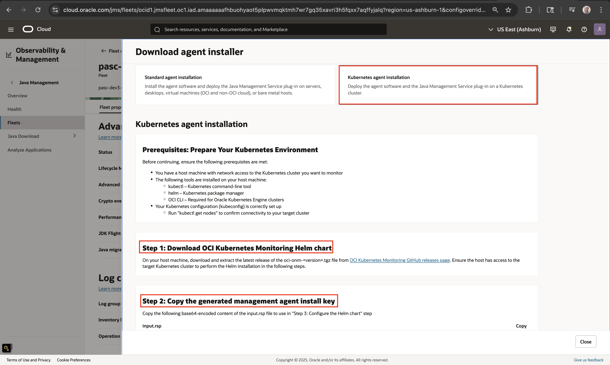
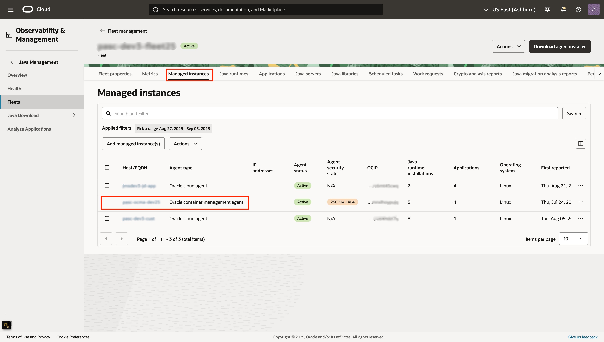
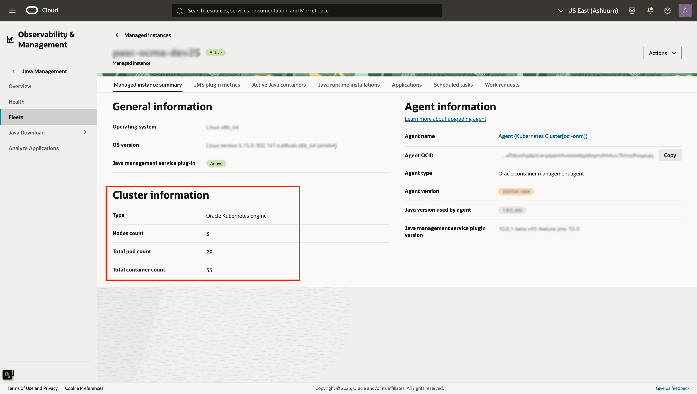
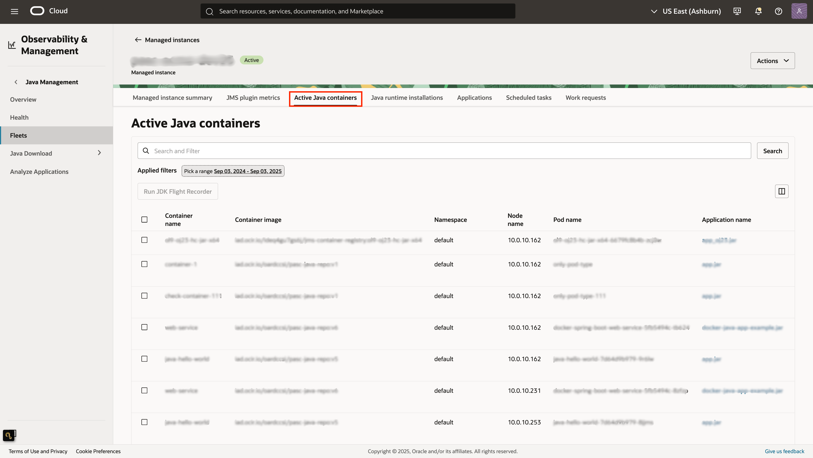

# JMS Kubernetes Support 

## Introduction

This guide will walk you through setting up and using Oracle Java Management Service (JMS) to monitor and manage Java applications running in Kubernetes clusters. JMS Kubernetes support extends your existing fleet management capabilities to containerized environments.

**Estimated Time:** 35 minutes

### Objectives

In this guide, you will:

* Set up JMS monitoring for Kubernetes clusters
* Monitor Java applications running in containers
* Manage your Kubernetes-based Java workloads through JMS

### Prerequisites

* Oracle Cloud Infrastructure account with appropriate permissions
* Access to a Kubernetes cluster 
* Java applications running in containers with JDK 
* Basic familiarity with Kubernetes concepts

## Task 1: Download the Kubernetes Agent

1. Open the navigation menu, navigate to **Observability & Management**. Under **Java Management**, click **Fleets**. Select the fleet that you have configured in [Lab 3](?lab=setup-a-fleet)

  

2. In your fleet details page, click **Download Agent Installer**.

   

3. Select **Kubernetes Agent Installation**, and follow the steps provided in the panel.

   

4. Under **Managed Instances**,once the installation is successfully completed, an entry for the newly added agent should appear.

   

5. On the Managed instance details page, you can view cluster information, including the **type** and **container count**. The container count includes both Active Java and non-Java containers.

   

6. Under **Active Java Containers**, you can see a list of all running Java containers.

   

## Learn More

* [JMS Advanced Features Documentation](https://docs.oracle.com/en-us/iaas/jms/doc/advanced-features.html)
* [Kubernetes Monitoring Best Practices](https://docs.oracle.com/en-us/iaas/Content/ContEng/home.htm)
* [Java Flight Recorder Guide](https://docs.oracle.com/javacomponents/jmc-5-4/jfr-runtime-guide/)

## Acknowledgements

* **Author** - EL-MANANI Fatima, Java Management Service 